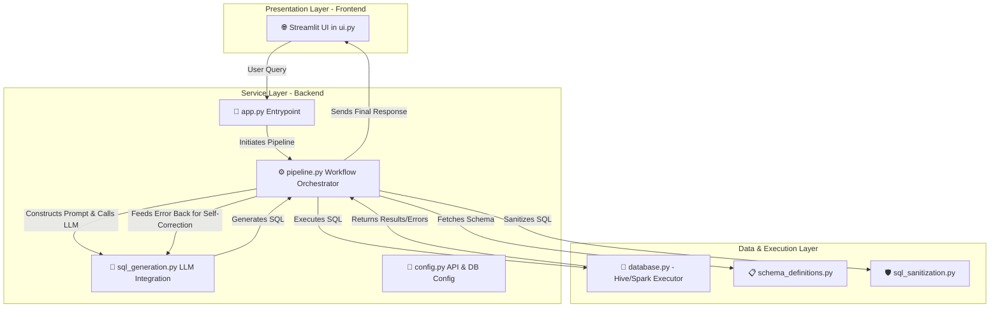

# SilkbyteX Query

## Project Overview

# SilkbyteX Query: A Self-Correcting Text-to-SQL Engine for the Yelp Dataset


**SilkbyteX Query is an enterprise-grade, conversational AI application that translates plain-English questions into executable SQL queries against the Yelp Open Dataset, featuring a self-correcting execution engine and a premium, multimodal user interface.**

---

## 1. Project Overview

This project implements a full-stack, conversational Text-to-SQL application designed for complex analytical queries on the Yelp dataset. The system architecture is composed of three distinct layers: a premium frontend built with Streamlit, a modular Python backend service layer, and a robust data execution layer powered by Apache Spark/Hive.

The core of the application is its intelligent workflow, which dynamically injects database schema context into a Large Language Model (LLM) to generate precise SQL. More critically, the system features a **self-correcting execution loop**: when a generated query fails, the application intelligently captures the database error, feeds it back to the LLM, and requests a correction, ensuring high reliability and a seamless user experience. The interface delivers responses in multiple formats, including syntax-highlighted SQL, interactive data tables, and automatically generated charts, providing a rich environment for data exploration.

## 2. System Architecture

The application follows a modular, three-layer architecture to ensure separation of concerns, scalability, and maintainability.



-   **Presentation Layer (`ui.py`):** A pure-Python, premium user interface built with Streamlit. It is responsible for capturing user input, managing the conversational state, and rendering multimodal responses (text, code, dataframes, and charts).
-   **Service Layer (`app.py`, `pipeline.py`, `sql_generation.py`):** The application's core logic. It receives requests from the UI, orchestrates the Text-to-SQL workflow, manages LLM API interactions, and handles configuration. The `pipeline.py` module is central to this layer, coordinating the steps from schema injection to final execution.
-   **Data & Execution Layer (`database.py`, `schema_definitions.py`):** This layer is responsible for all interactions with the big data backend. `database.py` contains the connection logic and execution engine for running queries against Hive/Spark. `schema_definitions.py` provides the dynamic, context-aware schema information that is critical for accurate SQL generation.

## 3. Requirement Satisfaction Checklist

This project successfully meets all specified requirements for the full-stack conversational application.

| Category | Requirement | Status | Implementation Notes |
| :--- | :--- | :--- | :--- |
| **Architecture** | **Three-Layer System** | ✅ | The codebase is cleanly separated into a Streamlit **Frontend** (`ui.py`), a modular **Backend** (`pipeline.py`, `sql_generation.py`), and a **Data Layer** (`database.py`). |
| **Workflow** | **Dynamic Schema Injection** | ✅ | The `pipeline.py` orchestrator programmatically loads table and column definitions from `schema_definitions.py` to enrich the LLM prompt with real-time context. |
| **Workflow** | **Natural Language Querying** | ✅ | The UI provides a conversational chat input for users to ask analytical questions in plain English, as demonstrated by the feature examples. |
| **Workflow** | **SQL Sanitization & Generation** | ✅ | The backend service layer is responsible for calling the LLM and uses `sql_sanitization.py` to securely extract and validate the executable SQL code. |
| **Workflow** | **Self-Correction Engine** | ✅ | The core execution loop in `pipeline.py` is wrapped in a try/except block. On database error, the exception is caught and fed back to the LLM for an automated repair attempt. |
| **UI/UX** | **Conversational Chat Layout** | ✅ | The interface in `ui.py` is built with `st.chat_message` to create a familiar, intuitive chat experience. |
| **UI/UX** | **Multimodal Responses** | ✅ | The UI is designed to dynamically render LLM-generated text, syntax-highlighted SQL code blocks, interactive `st.dataframe` tables, and automated charts via `charts.py`. |
| **UI/UX** | **Loading Indicators** | ✅ | The application provides clear visual feedback to the user during query execution to indicate that a background process is running. |

## 4. Core Technical Features

### Dynamic Schema Injection Engine

To ensure high accuracy in SQL generation, the system does not rely on a static, hardcoded prompt. Instead, it employs a dynamic schema injection mechanism. Before each call to the LLM, the `pipeline.py` orchestrator queries the `schema_definitions.py` module to retrieve the most current table names, column names, data types, and descriptions. This context is then programmatically formatted and prepended to the user's question, providing the LLM with a precise and relevant "map" of the database. This approach significantly reduces the likelihood of the model "hallucinating" incorrect column or table names.

### Self-Correcting SQL Execution Loop

A key innovation of this project is its resilience to LLM errors. Database query execution is inherently brittle, and even advanced models can produce syntactically incorrect SQL. To solve this, the application implements a self-correction loop:

1.  **Attempt Execution:** The backend's `pipeline.py` executes the initial SQL generated by the LLM.
2.  **Catch & Analyze:** If the database returns an error (e.g., `pyspark.sql.utils.AnalysisException`), the `except` block catches the specific error message.
3.  **Re-Prompt with Context:** The system automatically makes a second call to the LLM. This new prompt includes the original user question, the failed SQL query, and the exact database error log, explicitly asking the model to "fix the following query based on the error."
4.  **Retry Execution:** The corrected SQL is then sanitized and executed.

This automated two-step process allows the application to recover from common generation mistakes without user intervention, dramatically improving the reliability and success rate of the Text-to-SQL pipeline.

## 5. Installation & Local Setup

### Prerequisites

-   Python 3.10+
-   Access to a running Hive/Spark instance with the Yelp dataset loaded.

### Instructions

1.  **Clone the Repository:**
    ```bash
    git clone https://github.com/your-username/yelp-text-to-sql-app.git
    cd yelp-text-to-sql-app
    ```

2.  **Install Dependencies:**
    Create a virtual environment and install the required packages.
    ```bash
    python -m venv venv
    source venv/bin/activate
    pip install -r requirements.txt
    ```

3.  **Configure Environment Variables:**
    Create a `.env` file in the root of the project directory and add your credentials. This file is listed in `.gitignore` and will not be committed to source control.

    ```env
    # .env

    # DeepSeek API Configuration
    DEEPSEEK_API_KEY="your_deepseek_api_key_here"
    DEEPSEEK_MODEL="deepseek-coder"

    # Yelp Database Configuration (Hive Example)
    YELP_SQL_ENGINE="hive"
    HIVE_HOST="localhost"
    HIVE_PORT="10000"
    HIVE_USERNAME="your_hive_user"
    HIVE_PASSWORD="your_hive_password"
    HIVE_DATABASE="yelp_db"
    HIVE_AUTH="NONE"
    ```

4.  **Run the Application:**
    Launch the Streamlit application.
    ```bash
    streamlit run app.py
    ```

The application will be available at `http://localhost:8501`.
 It features a high-end editorial UI and a cinema-grade AI assistant experience, fully elevating it from a prototype to a sophisticated product demo.

The app allows a user to:
- ask analytical questions in plain English through a beautiful conversational interface
- automatically generate validated SQL from those questions
- execute the SQL against Yelp-related Big Data tables securely
- view the SQL trace, interactive result tables, and dynamic charts all within an elegant, immersive Streamlit application

The project also includes a flawless Demo/Mock Mode, ensuring the application remains universally accessible and demonstratable even when live model API access is strictly air-gapped or unconfigured.

## Main Features

- **Premium Editorial Aesthetics:** A heavily customized Black, White, and Bronze theme featuring fake-3D parallax motion, layered spotlights, and glassmorphic micro-navigation.
- **Natural-language to SQL Generation:** Powered by DeepSeek models via an optimized pipeline.
- **Voice-to-SQL Flow:** Present in the UI, but speech-to-text is currently disabled in the DeepSeek-only build.
- **Manual SQL Runner:** Direct query testing bypass capability.
- **Demo/Mock Mode:** Fully offline fallback state for university presentations.
- **Schema-aware Prompt Construction:** Dynamic injection of database structures.
- **SQL Sanitization:** Pre-execution stripping of invalid syntax or markdown.
- **Auto-Correction Engine:** One-step SQL self-correction retry when generated SQL fails against the database layer.
- **Intelligent Result Rendering:** Dynamic table styling, accompanied by automatic Plotly bar/line charts tailored to the returned data shape.

## Folder Structure

```text
yelp-text-to-sql-app/
├── app.py
├── requirements.txt
├── README.md
└── yelp_text_to_sql/
    ├── __init__.py
    ├── charts.py
    ├── config.py
    ├── database.py
    ├── prompt_schema.py
    ├── schema_definitions.py
    ├── sql_generation.py
    ├── sql_sanitization.py
    └── ui.py
```

## Setup Steps

1. Clone or download the project.

2. Install dependencies:

   ```bash
   pip install -r requirements.txt
   ```

   Optional for the premium microphone recorder:

   ```bash
   pip install audio-recorder-streamlit==0.0.10
   ```

   If that optional package is not installed, the app automatically falls back
   to Streamlit's built-in audio recorder.

3. Open `yelp_text_to_sql/schema_definitions.py` and confirm that the schema matches your own Yelp/Hive tables.

4. Configure your database connection environment variables if you want to run real SQL queries.

   You can either export them in your shell or place them in a local `.env` file
   in the project root. The app now loads `.env` automatically on startup.

   Start with the backend recommendation below before filling values.

5. Start the Streamlit app:

   ```bash
   streamlit run app.py
   ```

## Node-Master Deployment Preflight

Before final demo/deployment on `node-master`, run:

```bash
bash scripts/preflight_node_master.sh
```

This verifies:
- required Python packages (`pyhive`, `pyspark`, SQL stack)
- environment variables
- backend query smoke test
- required Yelp tables (`business`, `review`, `users`, `checkin`)
- text-to-SQL pipeline execution path

For a deeper SQL readiness check pack, run:

```bash
python scripts/validate_data_queries.py
```

One-command node-master run (preflight + API + Streamlit):

```bash
bash scripts/run_node_master.sh
```

## FastAPI Backend

This project now also exposes the same backend workflow through FastAPI so
external systems such as a PySpark job can call it over HTTP.

Install dependencies:

```bash
pip install -r requirements.txt
```

Run the API server:

```bash
uvicorn yelp_text_to_sql.api:app --host 0.0.0.0 --port 8000 --reload
```

Useful endpoints:

- `GET /health`
- `GET /config`
- `GET /schema`
- `POST /describe-table`
- `POST /run-test-query`
- `POST /execute-sql`
- `POST /generate-sql`
- `POST /text-to-sql`

Example request:

```bash
curl -X POST "http://localhost:8000/text-to-sql" \
  -H "Content-Type: application/json" \
  -d '{
    "question": "Show the top 10 cities by number of businesses",
    "use_demo_mode": false
  }'
```

Example PySpark-side call:

```python
import requests

response = requests.post(
    "http://localhost:8000/text-to-sql",
    json={
        "question": "Show the top 10 cities by number of businesses",
        "use_demo_mode": False,
    },
    timeout=120,
)
response.raise_for_status()
payload = response.json()
print(payload["final_sql"])
print(payload["rows"][:3])
```

## Environment Variables

The app may use the following environment variables depending on how you run it.

### Live model settings

- `DEEPSEEK_API_KEY`
- `DEEPSEEK_MODEL`
- `DEEPSEEK_BASE_URL`

### Database settings

- `YELP_SQL_ENGINE`
- `HIVE_HOST`
- `HIVE_PORT`
- `HIVE_USERNAME`
- `HIVE_PASSWORD`
- `HIVE_DATABASE`
- `HIVE_AUTH`
- `SPARK_MASTER`
- `SPARK_APP_NAME`
- `SPARK_WAREHOUSE_DIR`
- `HIVE_METASTORE_URI`
- `SPARK_SQL_CATALOG_IMPLEMENTATION`

### Optional app settings

- `APP_TITLE`
- `APP_ICON`
- `DEFAULT_QUESTION`
- `DEBUG_MODE`

## How to Run in Demo/Mock Mode

Demo/Mock Mode is useful when:
- the DeepSeek API is not configured
- you want to demo the UI quickly
- you want to continue testing without live model calls

How to use it:

1. Start the app:

   ```bash
   streamlit run app.py
   ```

2. In the UI, keep `Use Demo/Mock Mode` turned on.

3. Use one of the example questions or type one of the supported demo questions manually.

Demo/Mock Mode currently supports example questions such as:
- `Show the first 5 businesses`
- `Count the number of reviews`
- `Count the number of reviews per year`
- `Show the top 10 cities by number of businesses`
- `Show the top 10 users by review count`

## How to Run in Live Mode

Live mode uses a real DeepSeek model for natural-language to SQL generation.

### Hive-First Recommendation

For your current project stage, start with Hive first:

- use `YELP_SQL_ENGINE=hive`
- point `HIVE_HOST` at the machine running HiveServer2
- keep the rest of the app unchanged

This is the simplest path when your Yelp tables live on another machine.

### Choose Hive or Spark First

For most student big-data setups:

- Start with `YELP_SQL_ENGINE=hive` if your Yelp tables live on another machine and
  HiveServer2 is the easiest network-accessible service.
- Use `YELP_SQL_ENGINE=spark` if this machine can start Spark directly and see the
  same Yelp tables or shared Hive metastore.

If your cluster is on another laptop, Hive is usually the simpler first choice.

### Example `.env` for Hive

```env
# Live model
DEEPSEEK_API_KEY=your_api_key_here
DEEPSEEK_MODEL=deepseek-chat
DEEPSEEK_BASE_URL=https://api.deepseek.com

# Backend engine
YELP_SQL_ENGINE=hive

# TODO: Set these to the machine running HiveServer2
HIVE_HOST=TODO_your_hive_server_ip_or_hostname
HIVE_PORT=10000
HIVE_DATABASE=default
HIVE_AUTH=NONE
HIVE_USERNAME=
HIVE_PASSWORD=
```

### Example `.env` for Spark

```env
# Live model
DEEPSEEK_API_KEY=your_api_key_here
DEEPSEEK_MODEL=deepseek-chat
DEEPSEEK_BASE_URL=https://api.deepseek.com

# Backend engine
YELP_SQL_ENGINE=spark

# TODO: Use local[*] for local Spark or spark://host:7077 for a remote master
SPARK_MASTER=local[*]
SPARK_APP_NAME=YelpTextToSQL
SPARK_WAREHOUSE_DIR=

# TODO: Fill this only if Spark must connect to a shared Hive metastore
HIVE_METASTORE_URI=
SPARK_SQL_CATALOG_IMPLEMENTATION=hive
```

### Backend Setup Steps

1. Fill these live Hive environment values in `.env`:

   ```env
   YELP_SQL_ENGINE=hive
   HIVE_HOST=TODO_your_hive_server_ip_or_hostname
   HIVE_PORT=10000
   HIVE_DATABASE=default
   HIVE_AUTH=NONE
   HIVE_USERNAME=
   HIVE_PASSWORD=
   DEEPSEEK_API_KEY=TODO_your_deepseek_api_key
   DEEPSEEK_MODEL=deepseek-chat
   DEEPSEEK_BASE_URL=https://api.deepseek.com
   ```

   Notes:
   - `HIVE_HOST` should be the IP or hostname of the machine running HiveServer2.
   - `HIVE_AUTH` should usually stay `NONE` unless your Hive setup uses LDAP or Kerberos.
   - `HIVE_USERNAME` and `HIVE_PASSWORD` are optional unless your Hive server requires them.

2. Install the Hive client dependency:

   ```bash
   pip install pyhive
   ```

3. Optional but recommended: test basic connectivity outside Streamlit first:

   ```bash
   python3 yelp_text_to_sql/database.py
   ```

   This runs `SELECT * FROM business LIMIT 5` directly through the database layer.

4. Fill your DeepSeek settings if they are not already in `.env`:

   ```bash
   export DEEPSEEK_API_KEY="your_api_key_here"
   export DEEPSEEK_MODEL="deepseek-chat"
   export DEEPSEEK_BASE_URL="https://api.deepseek.com"
   ```

   Or put the same values in `.env`.

5. Confirm your real Hive backend already contains the Yelp tables:
   - `business`
   - `rating`
   - `users`
   - `checkin`

6. If the backend is on another machine, confirm this laptop can reach it over the network.
   For Hive, that usually means the machine running HiveServer2 must be reachable on
   `HIVE_HOST:HIVE_PORT`.

7. Review `yelp_text_to_sql/schema_definitions.py` and compare it with:
   - `DESCRIBE business`
   - `DESCRIBE rating`
   - `DESCRIBE users`
   - `DESCRIBE checkin`

8. Start the app:

   ```bash
   streamlit run app.py
   ```

9. In the UI, turn off `Use Demo/Mock Mode`.

10. Enter a natural-language question and click `Generate and Run SQL`.

If live model settings are missing, the app shows a beginner-friendly message instead of crashing.

## Live Validation Checklist

Test the live path in this order:

1. Hardcoded database test query
   - Run `SELECT * FROM business LIMIT 5` using the built-in database test button.
   - Goal: confirm the app can reach the backend and the `business` table exists.

2. One manual SQL query
   - Example:

   ```sql
   SELECT city, COUNT(*) AS business_count
   FROM business
   GROUP BY city
   ORDER BY business_count DESC
   LIMIT 10
   ```

   - Goal: confirm real SQL execution works before involving the LLM.

3. One natural-language live query
   - Example: `Show the top 10 cities by number of businesses`
   - Goal: confirm schema injection, SQL generation, sanitization, execution, and UI rendering all work together.

4. One failed query that triggers retry/self-correction
   - Ask a harder natural-language question or temporarily use a case that is likely to produce a SQL error.
   - Goal: confirm the app catches the first database failure, asks for one corrected SQL query, and retries once.

### Short Validation Sequence

Use this exact order for your live demo:

1. Fill `.env` for Hive and DeepSeek.
2. Install `pyhive`.
3. Run `python3 yelp_text_to_sql/database.py`.
4. Start the app with `streamlit run app.py`.
5. Run the built-in database test.
6. Run one manual SQL query.
7. Run one live natural-language question.
8. Trigger one failed query and confirm the retry happens once.

## Testing

This project includes a small pytest test suite for core non-UI logic.

The tests cover:
- SQL sanitization
- Demo/Mock Mode behavior
- Simple chart decision logic
- Pipeline success and failure structure
- Missing live-model configuration handling

To run the tests:

```bash
pip install pytest
pytest
```

These tests do not require a live Hive, Spark, or DeepSeek connection.

## Example Questions

You can try questions like:

- Show the first 5 businesses
- Count the number of reviews
- Count the number of reviews per year
- Show the top 10 cities by number of businesses
- Show the top 10 users by review count
- Which cities have the most businesses?
- Show businesses with the highest review count

## Known Limitations

- Demo/Mock Mode supports only a small set of hardcoded example questions.
- Live SQL generation depends on correct API and database configuration.
- SQL self-correction retries only once.
- Chart generation is intentionally simple and only works for basic result shapes.
- The app depends on the schema file being kept accurate manually.
- Different Hive or Spark environments may require additional connection settings.
- If your backend is on another laptop or VM-only network, connectivity must be solved at the network level before the app can connect.

## Future Improvements

- Add more robust SQL error correction
- Add stronger SQL validation and safety checks
- Improve prompt engineering for more accurate SQL generation
- Support richer chart types
- Add better conversational history and multi-turn context
- Add unit tests and integration tests
- Improve database dialect handling across Hive and Spark SQL

## Submission Notes

This project is designed as a university-friendly demonstration of:
- full-stack application design
- schema-aware prompt engineering
- SQL generation from natural language
- database execution and result presentation
- iterative development with both demo mode and live mode


D
